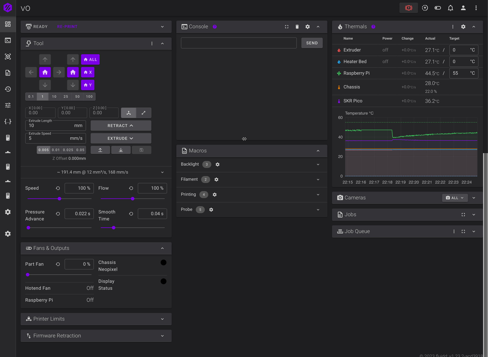

# Voron 0.1 and Ender 3 Pro setup

That's repo is a backup for all my home printers configs

## Voron 0.1
- Part Fans: 2x GDStime GDB3010 DC24V 0.05A
- Hotend Fan: Sunon MagLev MC30060V2-000C-A99 DC5V 0.36W 
- LDO Motors: 
 - X/Y: 1.8° NEMA14 Stepper Motor HT LDO-35STH52-1504AH(VRN)
 - Z: 1.8° NEMA17 Stepper Motor LDO-42STH25-1004CL200ET(VRN
 - E: 1.8° 36mm Round Pancake Stepper LDO-36STH20-1004AHG(VRN)
- SKR Pico + Raspberry Pi 3B+
- BTT ADXL345
- Mellow Dragonfly BMO
- Voron OLED LCD
- Umbilical PCB
- DHT11 Chassis Sensor
- WS2812B LED Strips
- Custom Filament Runout Sensor
- Raspberry Pi Camera
- SideSwipe Probe

## Ender 3 Pro
- SKR Pico + Raspberry Pi 3B+
- E3D Volcano Hotend Direct Drive
- BMG Clone
- FlipperScreen with MKS TFT35 v2.0
- ADXL345
- BLTouch Clone
- Custom Filament Runout Sensor
- RTSP Camera
